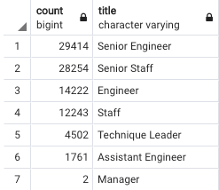
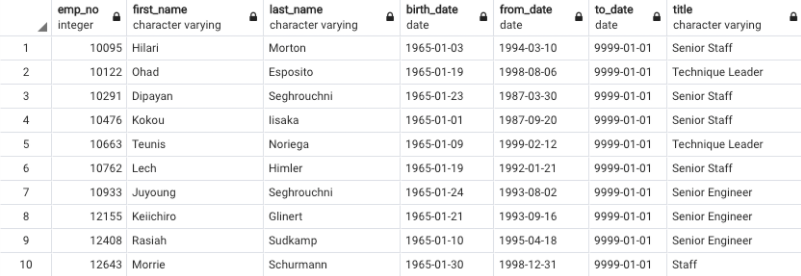

# Overview of the analysis:
To determine the number of retiring employees by title and identify employees who are eligible to participate in a mentorship program. 

# Results: Provide a bulleted list with four major points from the two analysis deliverables. Use images as support where needed.
- We created a table to find the list of employees at the retirement age by title and the criteria of those who were born between the years 1952 and 1955. 
- Next, we had to remove any duplicates as some employees had different titles over their employment. By using the DISTINCT ON function, we can pull the employee number just once as a unique number.
- We were able to determine the number of retiring employees by title with COUNT of employee numbers and GROUP BY title.

- We also created a table to determine which employees would be eligible for the mentorship program. Those employees who were born in the year 1965 would be deemed eligible.
- We combined employees, dept_emp and titles table with the INNER JOIN function to create a new table to find the eligible employees.

# Summary: 
How many roles will need to be filled as the "silver tsunami" begins to make an impact?
According to the SUM of the count of retiring titles, there will be 90,398 roles that will need to be filled.

Are there enough qualified, retirement-ready employees in the departments to mentor the next generation of Pewlett Hackard employees?
There are currently not enough employees who are able to be mentors given the criteria of only those who were born in 1965. There are only 1940 employees who are able to be mentors.
If we expanded the eligiblity to those who were born beofre 1965 but after the current year for the retirees, the population would be more than enough to help mentor the next generation. 

